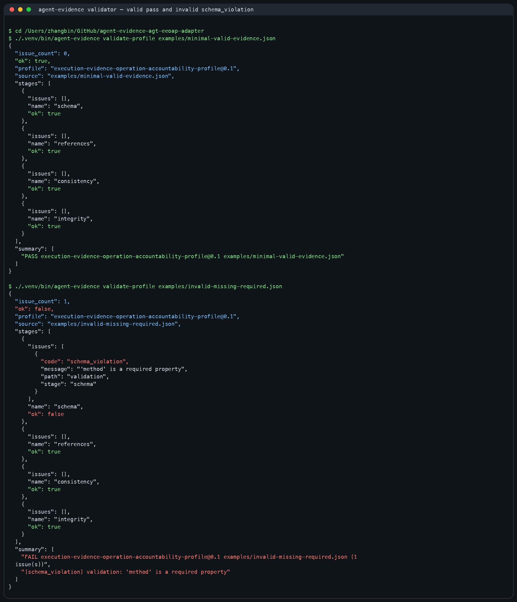
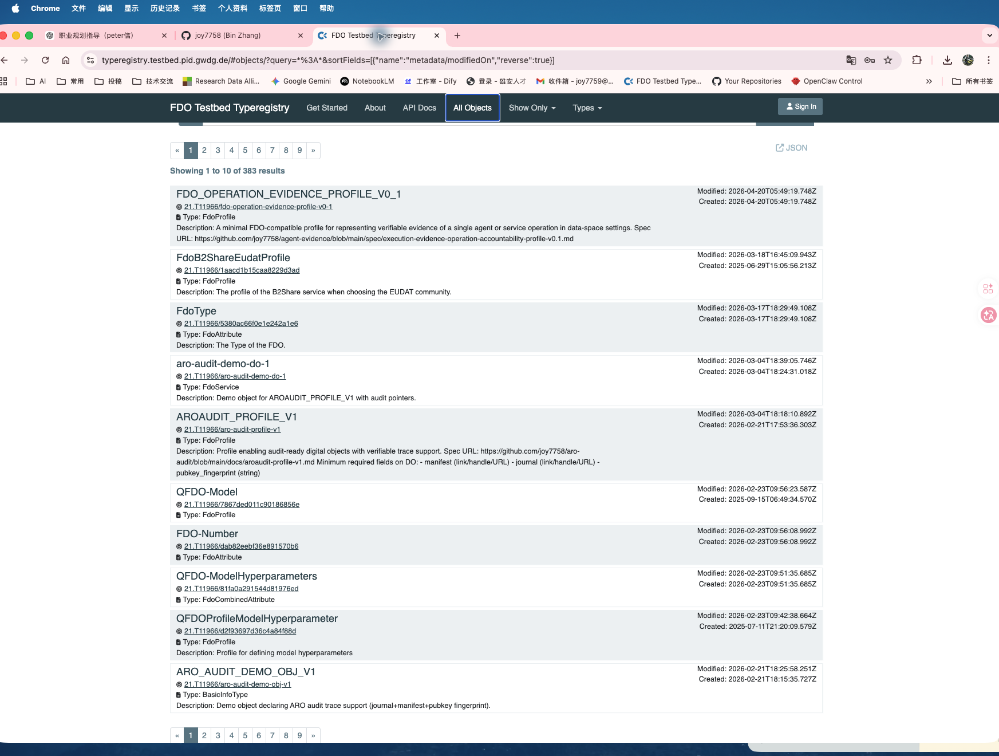

# agent-evidence

把 AI Agent / service operation 转换为可验证、可审计、可复核的 evidence object。<br>
Turn AI agent operations into auditable and verifiable evidence objects.

DOI: [10.5281/zenodo.19334061](https://doi.org/10.5281/zenodo.19334061)

[](https://github.com/joy7758/agent-evidence/actions/workflows/ci.yml)


## Why this matters

普通 AI workflow 通常只留下聊天记录、trace 页面或零散日志。它们能帮助开发者排查问题，但很难直接交给审查者、客户、治理团队或后续系统复核。

`agent-evidence` 关注的是一次 Agent / service operation 结束之后，能不能留下结构化证据：operation、policy、provenance、evidence、validation、hashes、verification result，以及可以被 validator 检查的 evidence object。

这个仓库的目标不是再做一个通用 Agent 平台，而是提供一个最小、可运行、可验证的 operation evidence 路径。

## What it provides

- `Execution Evidence and Operation Accountability Profile v0.1`
- JSON Schema
- profile-aware validator
- valid / invalid examples
- runnable single-path demo
- LangChain-first evidence exporter and offline bundle verification
- FDO-style mapping material for discussion, not a claim of official standard adoption
- v0.4.0 Review Pack release preparation, with local offline reviewer-facing
  packaging for verified signed exports

## Quick Start

Install from source:

```bash
python3 -m venv .venv
source .venv/bin/activate
pip install -e ".[dev]"
```

Validate a minimal valid evidence profile:

```bash
agent-evidence validate-profile examples/minimal-valid-evidence.json
```

Check that an intentionally invalid example fails:

```bash
agent-evidence validate-profile examples/invalid-missing-required.json
```

Run the single-path demo:

```bash
python3 demo/run_operation_accountability_demo.py
```

Expected result:

- the valid example returns JSON with `"ok": true`
- the invalid example returns JSON with `"ok": false` and one primary error code
- the demo writes artifacts under `demo/artifacts/` and ends with one `PASS` summary line

## Fastest LangChain proof

For the current LangChain-first path:

```bash
pip install -e ".[dev,langchain,sql]"
python integrations/langchain/export_evidence.py
agent-evidence verify-bundle --bundle-dir integrations/langchain/langchain-evidence-bundle
```

This runs the documented LangChain exporter and verifies the emitted bundle offline.

For a smaller callback/export recipe aimed at external readers, see [LangChain minimal evidence cookbook](./docs/cookbooks/langchain_minimal_evidence.md).

## Example Evidence Fields

The minimal profile binds these parts into one reviewable object:

- `statement_id` — one accountable operation statement
- `operation` — what operation happened, on which subject, with which inputs and outputs
- `policy` — which rule or constraint set was referenced
- `provenance` — which actor and references connect the operation to inputs and outputs
- `evidence` — artifacts, references, and integrity digests
- `validation` — method, validator, status, and linked evidence/provenance/policy
- `subject` and `actor` — object and runtime identity used by the statement

## Demo Screenshots

Validator proof:



FDO Testbed registration proof:



## Relation to FDO

`agent-evidence` is an experimental, minimal, discussion-oriented operation evidence profile. It explores how AI / Agent operation evidence can be expressed with an FDO-style object shape: identity, metadata, references, provenance, integrity, and validation.

It is not an official FDO standard. The current public claim is narrower: this repository provides a working profile, schema, examples, validator, demo, and FDO-facing mapping material for discussion.

FDO-facing reading path:

- [Execution Evidence to FDO](./docs/fdo-mapping/execution-evidence-to-fdo.md)
- [Minimal FDO-style Object Example](./docs/fdo-mapping/minimal-fdo-object-example.md)
- [FDO Relevance](./release/fdo-relevance.md)
- [Public positioning](./docs/outreach/public-positioning.md)
- [Lineage map](./docs/lineage.md)

## For hiring managers

This repository shows that I can:

- turn LangChain / Agent workflow thinking into a concrete evidence boundary
- design JSON Schema and validator logic for high-responsibility AI workflows
- model audit trail, provenance, hashes, and verification results as deliverable artifacts
- connect trustworthy AI governance ideas to runnable examples
- package technical work as open-source documentation, examples, release artifacts, and CLI validation

## Canonical package

The current canonical package is `Execution Evidence and Operation Accountability Profile v0.1`.

Core entry points:

- Spec: [spec/execution-evidence-operation-accountability-profile-v0.1.md](./spec/execution-evidence-operation-accountability-profile-v0.1.md)
- Schema: [schema/execution-evidence-operation-accountability-profile-v0.1.schema.json](./schema/execution-evidence-operation-accountability-profile-v0.1.schema.json)
- Validator CLI: `agent-evidence validate-profile <file>`
- Examples: [examples/README.md](./examples/README.md)
- Demo: [demo/README.md](./demo/README.md)
- Reviewer-facing high-risk entry: [docs/high-risk-scenario-entry.md](./docs/high-risk-scenario-entry.md)
- Status and acceptance: [docs/STATUS.md](./docs/STATUS.md), [docs/ACCEPTANCE-CHECKLIST.md](./docs/ACCEPTANCE-CHECKLIST.md)
- Submission handoff: [submission/package-manifest.md](./submission/package-manifest.md), [submission/final-handoff.md](./submission/final-handoff.md)

## What You Get

After one run, the primary outputs are intentionally narrow:

- `bundle` — exported evidence package that can be handed off, verified, and retained outside the original runtime
- `receipt` — machine-readable verification result returned by `agent-evidence validate-profile`, `agent-evidence verify-bundle`, or `agent-evidence verify-export`
- `summary` — reviewer-facing summary output produced by the current demo and example surfaces

## Why this is not just tracing

Tracing and logs help operators inspect a run. Agent Evidence packages runtime events into portable artifacts that another party can verify later, including offline.

Evidence path:

`runtime events -> evidence bundle -> signed manifest -> detached anchor (when present) -> offline verify`

External anchoring is out of scope for AEP v0.1 and is not enabled by default.

The toolkit currently supports two storage modes:

- append-only local JSONL files
- SQLAlchemy-backed SQLite/PostgreSQL databases

The current model treats each record as a semantic event envelope:

- `event.event_type` is framework-neutral, such as `chain.start` or `tool.end`
- `event.context.source_event_type` preserves the raw framework event name
- `hashes.previous_event_hash` links to the prior event
- `hashes.chain_hash` provides a cumulative chain tip for integrity checks

## Integration Priorities

Current priority order:

1. LangChain / LangGraph
2. OpenAI-compatible runtimes
3. Automaton sidecar export, marked experimental

The goal is one narrow evidence handoff surface, not many adapters at once.

## Automaton Sidecar Exporter

The read-only Automaton sidecar/exporter reads `state.db`, git history, and persisted on-chain references, then emits an AEP bundle plus `fdo-stub.json` and `erc8004-validation-stub.json`.

```bash
agent-evidence export automaton \
  --state-db /path/to/state.db \
  --repo /path/to/state/repo \
  --runtime-root /path/to/automaton-checkout \
  --out ./automaton-aep-bundle
```

`agent-evidence export automaton` has been validated against a live isolated-home Automaton run and remains marked experimental while the live data contract is still settling.

## CLI examples

```bash
agent-evidence record \
  --store ./data/evidence.jsonl \
  --actor planner \
  --event-type tool.call \
  --input '{"task":"summarize"}' \
  --output '{"status":"ok"}' \
  --context '{"source":"cli","component":"tool"}'

agent-evidence list --store ./data/evidence.jsonl
agent-evidence show --store ./data/evidence.jsonl --index 0
agent-evidence verify --store ./data/evidence.jsonl
```

SQL stores use a SQLAlchemy URL instead of a file path:

```bash
agent-evidence record \
  --store sqlite+pysqlite:///./data/evidence.db \
  --actor planner \
  --event-type tool.call \
  --context '{"source":"cli","component":"tool"}'

agent-evidence query \
  --store sqlite+pysqlite:///./data/evidence.db \
  --event-type tool.call \
  --source cli
```

## Development

```bash
make install
make test
make lint
make hooks
```

For PostgreSQL support, install the extra driver dependencies:

```bash
pip install -e ".[dev,postgres]"
```

For a repeatable real-database validation path, use the bundled Docker-backed integration script:

```bash
make install-postgres
make test-postgres
```

## Scope Boundaries

`agent-evidence` is the active code surface here for `bundle`, `receipt`, and `summary`.

It is not:

- the full Digital Biosphere Architecture stack
- the audit control plane
- the walkthrough demo
- the execution-integrity kernel
- a generic agent governance platform
- an official FDO standard

## Related Surfaces

- Architecture: [digital-biosphere-architecture](https://github.com/joy7758/digital-biosphere-architecture)
- Demo: [verifiable-agent-demo](https://github.com/joy7758/verifiable-agent-demo)
- Audit: [aro-audit](https://github.com/joy7758/aro-audit)
- Historical map: [docs/lineage.md](./docs/lineage.md)

## English Summary

`agent-evidence` turns AI agent operations into structured evidence objects that can be validated, reviewed, and retained outside the original runtime. The project focuses on a minimal operation evidence profile, JSON Schema, validator, examples, LangChain export, offline bundle verification, and FDO-facing discussion material. It is experimental and discussion-oriented, not an official FDO standard.
