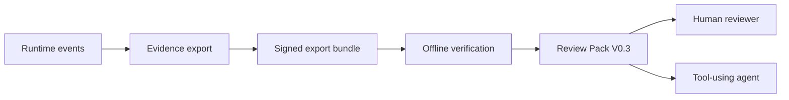
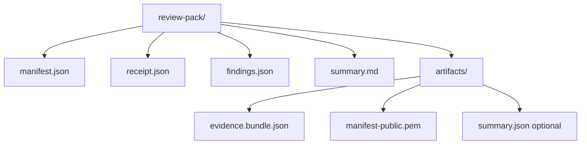
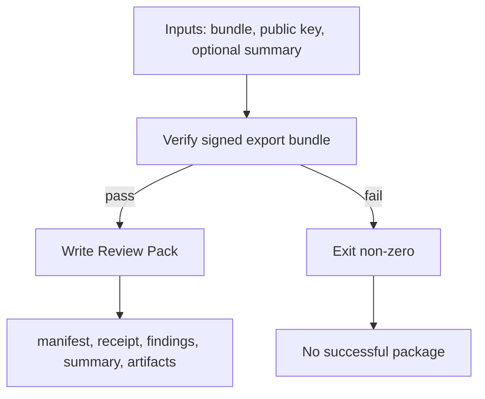
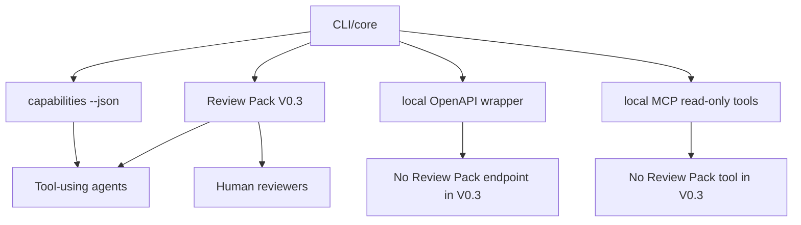
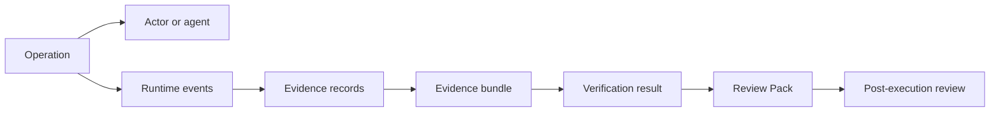

# Agent Evidence Review Packs

Local, Verifiable, Reviewer-Facing Artifacts for AI Agent Runs

## Abstract

AI agent runs increasingly produce traces, logs, tool-call records, and
framework-specific observability data. These artifacts are useful for
operators, but they are often tied to the platform that produced them and are
not always easy to hand to an independent reviewer after execution. Review Pack
V0.3, implemented in `agent-evidence` v0.6.0, turns a verified AI agent runtime
evidence bundle into a local, offline, fail-closed, markdown/JSON-only package
for review. The package combines machine-readable manifest, receipt, and
findings files with a human-readable `summary.md`, stable reviewer checklist
IDs, conservative secret sentinel reporting, and optional machine-readable
failure output. This draft describes Review Pack V0.3 as an implemented
technical artifact and states its limits: it is not legal non-repudiation,
compliance certification, AI Act approval, an official FDO standard, a full AI
governance platform, or comprehensive DLP.

## Problem Statement

AI agent traces are often platform-bound. A trace page can help the team that
operates the platform, but it may not be portable enough for later review by a
customer, auditor, governance team, research collaborator, or another tool-using
agent.

Reviewers need post-execution artifacts that can be retained and inspected
outside the original runtime. Those artifacts should preserve verification
status, show what evidence was included, and make limits visible without
turning the review package into a governance platform.

Agentic engineering also needs artifacts that are readable by both humans and
agents. A reviewer can use prose and checklist items; an agent can inspect JSON
metadata, receipt fields, findings, and structured errors. Review Pack V0.3 is
designed for that dual review surface.

## Design Goals

Review Pack V0.3 is intentionally narrow. Its design goals are:

- local and offline operation
- verify-first pack creation
- fail-closed behavior on verification failure
- markdown/JSON-only output
- reviewer-facing `summary.md`
- machine-readable `manifest.json`, `receipt.json`, and `findings.json`
- stable reviewer checklist IDs
- no private key copying
- no network requirement
- conservative secret sentinel reporting
- optional machine-readable failure output for agent callers
- no legal, compliance, or AI Act claims

The implementation should preserve existing evidence semantics. Review Pack is
a packaging and review layer above verified signed exports, not a rewrite of
the core evidence schema.

## Non-Goals

Review Pack V0.3 is not:

- legal non-repudiation
- compliance certification
- AI Act approval
- an official FDO standard
- a full AI governance platform
- comprehensive DLP
- a hosted review service
- a remote review service
- a PDF or HTML report generator
- a dashboard
- an OpenAPI Review Pack endpoint
- an MCP Review Pack tool

These non-goals are not incidental. They keep Review Pack positioned as a
bounded local review package instead of a broad governance or compliance
product.

## System Context

`agent-evidence` v0.6.0 provides several local surfaces around one evidence
boundary:

- CLI/core as the canonical callable surface
- `agent-evidence capabilities --json` for structured capabilities metadata
- local OpenAPI thin wrapper for HTTP callers
- local MCP stdio tools that remain read-only and verify-first
- LangChain 5-minute runnable evidence path
- OpenAI-compatible mock/offline runnable evidence path
- Review Pack V0.3 for local reviewer-facing packaging

The local OpenAPI and MCP surfaces do not expose Review Pack V0.3 in this
release. Review Pack creation remains a CLI surface through
`agent-evidence review-pack create`.



## Review Pack V0.3 Artifact Model

A successful Review Pack V0.3 writes this layout:

```text
review-pack/
  manifest.json
  receipt.json
  findings.json
  summary.md
  artifacts/
    evidence.bundle.json
    manifest-public.pem
    summary.json optional
```



### `manifest.json`

`manifest.json` records package-level metadata for the reviewer and for
tool-using agents. V0.3 fields include Review Pack version,
`pack_creation_mode: local_offline`, verification status, record and signature
counts, included artifacts, artifact inventory, reviewer checklist, conservative
`secret_scan_status`, and non-claims.

### `receipt.json`

`receipt.json` records the verification and packaging receipt. It repeats the
review pack version, verification result, record and signature counts, artifact
inventory, a reviewer checklist reference, `secret_scan_status`, and
non-claims.

### `findings.json`

`findings.json` contains a bounded findings list. Findings are intended to help
reviewers and agents inspect the package state. They are not a compliance
taxonomy.

### `summary.md`

`summary.md` is the human-readable review entry point. It includes verification
outcome, reviewer checklist, verification details, artifact inventory, findings,
secret and private key boundary language, recommended reviewer actions, and
what the package does not prove.

### `artifacts/evidence.bundle.json`

This is the signed evidence bundle copied into the Review Pack after
verification succeeds.

### `artifacts/manifest-public.pem`

This is the public key used for verification. Review Pack creation does not
copy private keys.

### `artifacts/summary.json`

This optional file is included only when the caller provides a source summary.

## Verification Flow

Review Pack creation verifies before packaging. The signed export bundle and
public key are supplied as inputs. The existing verification logic determines
whether the bundle can be trusted enough to package for review.

If verification fails, Review Pack creation fails closed:

- a tampered bundle fails
- a bad public key fails
- no successful pack is produced
- no misleading `summary.md` is written
- source artifacts are not mutated
- the output directory is not silently overwritten

This flow keeps Review Pack as a packaging layer over verified evidence rather
than a parallel verifier.



## Reviewer Checklist

Review Pack V0.3 adds stable reviewer checklist IDs:

- `RP-CHECK-001`: Confirm verification outcome is pass.
- `RP-CHECK-002`: Review the included evidence bundle.
- `RP-CHECK-003`: Review the public key used for verification.
- `RP-CHECK-004`: Review findings and warnings.
- `RP-CHECK-005`: Review limitations before relying on the pack.
- `RP-CHECK-006`: Escalate fail or unknown findings.

The checklist is a reviewer workflow aid. It is not a compliance checklist, an
approval workflow, or a substitute for domain-specific review.

## Findings and Status Model

Finding severities are limited to:

- `pass`
- `warning`
- `fail`
- `unknown`

The taxonomy stays bounded to verification, signature, artifact inventory,
private key exclusion, configured secret sentinel reporting, reviewer checklist
presence, limitation notice, and fail-closed categories.

`pack_creation_mode: local_offline` records the intended creation mode.

`secret_scan_status` is deliberately conservative. It reports the configured
secret sentinel scan status for generated Review Pack content. It is not
comprehensive DLP and does not prove that all possible secrets are absent.

## Agent-Native Use

Review Pack V0.3 is useful to tool-using agents because it has both human and
machine-readable surfaces:

- `manifest.json` describes package metadata and inventory
- `receipt.json` records verification and packaging status
- `findings.json` exposes bounded findings
- `summary.md` gives a human-readable review entry point
- `--json-errors` supports machine-readable failure handling for
  `review-pack create`
- `capabilities --json`, `agent-index.json`, and `llms-full.txt` help agents
  discover current project boundaries

Review Pack is not exposed through OpenAPI or MCP in v0.3. This avoids adding
remote or wrapper-specific review-pack semantics before the local CLI surface is
fully settled.



## Evaluation and Validation

The current validation story is practical rather than benchmark-driven.
Existing tests and smoke paths cover:

- LangChain Review Pack smoke
- OpenAI-compatible mock Review Pack smoke
- signed export verification success
- tampered bundle fail-closed behavior
- bad public key fail-closed behavior
- non-empty output directory protection
- no private key copied into the Review Pack
- configured secret sentinel has no hit
- no network requirement for local/mock paths
- `--json-errors` smoke
- generated metadata checks
- docs and metadata consistency checks

This draft does not invent benchmark numbers. The important result for the
current artifact is repeatability: local commands, local outputs, explicit
failure behavior, and checked non-claims.

## Relationship to Operation Accountability Profile

Review Pack V0.3 supports post-execution operation accountability by packaging
evidence for review. In the current research framing, an operation includes the
runtime path, actor or agent, event records, exported evidence, verification
result, and reviewer-facing package.



Operation Accountability Profile remains a working research concept. It is not
an official standard, official AI Act compliance profile, legal proof, or full
governance automation.

## Relationship to FDO / Data Space Context

Review Pack V0.3 can be discussed in FDO and data-space terms because it
packages portable digital artifacts:

- evidence bundles can be treated as digital objects
- manifests and receipts can act as review metadata
- Review Packs can support data-space-style accountability workflows
- citation metadata can support attribution and exact-version reference

This relationship is conceptual. Review Pack V0.3 is not an official FDO
profile, official FDO standard, data-space connector, policy enforcement
system, remote registry, or compliance guarantee.

## Future Work

Future work should stay staged:

- Review Pack stabilization after more external review
- controlled redaction and reporting research
- clearer privacy-preserving evidence packaging
- broader runtime integration evaluation
- AI Act Pack planning as a future interpretation layer
- possible paper or technical report submission

AI Act Pack should be built only after the evidence and review package boundary
is stable. It should interpret Review Pack outputs rather than merge regulatory
claims into the Review Pack itself.

## Limitations

Review Pack V0.3 remains a beta reviewer-facing package. It supports review, but
it does not replace review.

It is not:

- legal proof
- legal non-repudiation
- compliance certification
- AI Act approval
- an official FDO standard
- a full AI governance platform
- comprehensive DLP
- hosted governance
- a hosted review service
- a remote review service
- a complete data-space connector

The package makes a verified evidence bundle easier to inspect. It does not
prove that the original runtime was complete, that all possible secrets are
absent, that every domain-specific policy was satisfied, or that legal or
regulatory duties were met.
