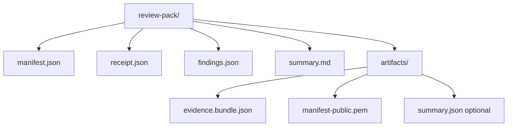
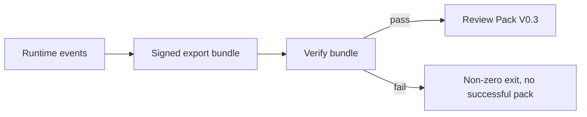
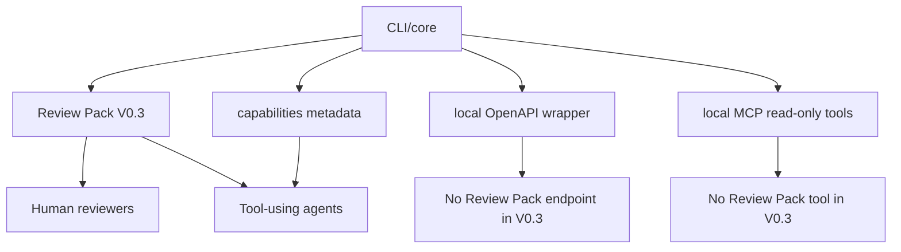

# Agent Evidence Review Packs

Local, Verifiable, Reviewer-Facing Artifacts for AI Agent Runs

## Abstract

AI agent systems often leave behind platform-bound traces, logs, and tool-call
records that are useful for operators but difficult to hand to independent
reviewers after execution. This technical note presents Review Pack V0.3,
implemented in `agent-evidence` v0.6.0, as a local, offline, verify-first,
fail-closed artifact package for AI agent runs. Review Pack V0.3 turns a
verified signed evidence bundle into markdown and JSON artifacts: manifest,
receipt, findings, summary, and copied public evidence artifacts. It adds
stable reviewer checklist IDs, conservative `secret_scan_status`,
`local_offline` creation metadata, and optional JSON error output for agent
callers. The contribution is not a legal or compliance system, but a bounded
review layer that supports human reviewers and tool-using agents. We describe
its artifact model, validation evidence, limitations, and relationship to
operation accountability, FDO/data-space mapping, and future AI Act-oriented
interpretation.

## Problem Statement

AI agent traces are often platform-bound. They may help an operator inspect a
run, but they are not always packaged for independent offline review.

Independent reviewers need portable post-execution artifacts that preserve
verification status, included evidence, findings, and limitations. Tool-using
agents need machine-readable artifacts that can be inspected without scraping
prose or calling a hosted trace system.

A useful review package should stay bounded. It should improve reviewability
without becoming a full AI governance platform, legal proof system, compliance
certificate, or hosted review service.

## Contributions

Review Pack V0.3 contributes four implemented, bounded pieces:

1. A local verify-first/fail-closed Review Pack artifact model for signed agent
   evidence bundles.
2. A dual human/agent review surface: `summary.md` plus
   `manifest.json`, `receipt.json`, and `findings.json`.
3. Stable reviewer checklist IDs and a bounded findings/severity model.
4. Conservative safety boundaries: no private key copying, no network
   requirement, and no comprehensive DLP, legal, or compliance claims.

These are artifact and workflow contributions. They are not claims of legal,
regulatory, or standard-setting status.

## System Scope and Non-Goals

Review Pack V0.3 is:

- local
- offline
- verify-first
- fail-closed
- markdown/JSON-only
- reviewer-facing

Review Pack V0.3 is not:

- legal non-repudiation
- compliance certification
- AI Act approval
- an official FDO standard
- a full AI governance platform
- comprehensive DLP
- a hosted review service
- a remote review service

The package does not add PDF/HTML output, dashboards, remote services,
OpenAPI Review Pack endpoints, or MCP Review Pack tools.

## Review Pack V0.3 Artifact Model

Review Pack V0.3 writes a small directory:

```text
review-pack/
  manifest.json
  receipt.json
  findings.json
  summary.md
  artifacts/
    evidence.bundle.json
    manifest-public.pem
    summary.json optional
```

`manifest.json` records package metadata, version, `pack_creation_mode`,
verification status, artifact inventory, reviewer checklist, conservative
`secret_scan_status`, and non-claims.

`receipt.json` records verification and packaging status, including record and
signature counts, artifact inventory, a reviewer checklist reference, and
non-claims.

`findings.json` records bounded findings with allowlisted severity values.

`summary.md` is the human-readable review entry point.

`artifacts/evidence.bundle.json` is the verified signed evidence bundle copied
into the pack.

`artifacts/manifest-public.pem` is the public key used for verification.
Private keys are not copied.

`artifacts/summary.json` is included only when the caller supplies an optional
summary.



## Verification and Packaging Flow

Review Pack creation starts from runtime evidence that has been exported into a
signed bundle. The bundle is verified before packaging. If verification fails,
the command fails closed.

Known failure cases include tampered bundles and bad public keys. On failure,
no successful pack is produced, no misleading `summary.md` is written, and
source artifacts are not mutated. The command also refuses to silently
overwrite a non-empty output directory.

Review Pack creation does not copy private keys and does not require network
access.



## Reviewer Checklist

Review Pack V0.3 includes stable checklist IDs:

- `RP-CHECK-001`: Confirm verification outcome is pass.
- `RP-CHECK-002`: Review the included evidence bundle.
- `RP-CHECK-003`: Review the public key used for verification.
- `RP-CHECK-004`: Review findings and warnings.
- `RP-CHECK-005`: Review limitations before relying on the pack.
- `RP-CHECK-006`: Escalate fail or unknown findings.

The checklist is a reviewer aid, not a compliance checklist. It helps reviewers
inspect the package consistently but does not approve, certify, or legally
attest to the run.

## Machine-Readable Review Surface

Review Pack V0.3 has a machine-readable surface for tool-using agents:

- `manifest.json` records package inventory and metadata.
- `receipt.json` records verification and packaging status.
- `findings.json` records bounded findings and severity values.
- `--json-errors` gives machine-readable failure output for
  `agent-evidence review-pack create`.

These artifacts help agents inspect Review Pack state without scraping only
human prose. They do not claim universal agent support or introduce a remote
review service.

## Safety Boundaries

Review Pack V0.3 keeps safety claims narrow:

- private keys are not copied
- configured secret sentinel checks are recorded
- `secret_scan_status` is conservative
- `secret_scan_status` is not comprehensive DLP
- the pack does not prove all possible secrets are absent
- no network is required
- no telemetry or remote review service is added

The secret scan boundary is important. Review Pack creation can check
configured sentinel patterns in generated pack content, but it does not
guarantee that arbitrary secrets cannot exist in source systems or supplied
evidence.

## Agent-Native Surfaces

The CLI/core remains the canonical callable surface. Around it,
`agent-evidence` exposes:

- `agent-evidence capabilities --json`
- generated `agent-index.json`
- generated `llms-full.txt`
- local OpenAPI thin wrapper
- local MCP read-only / verify-first tools

Review Pack V0.3 is not exposed through OpenAPI or MCP. Keeping Review Pack on
the CLI avoids adding wrapper-specific semantics before the local review package
boundary is settled.



## Evaluation and Validation Evidence

The current validation evidence is based on reproducible checks rather than
benchmark numbers:

- LangChain Review Pack smoke
- OpenAI-compatible mock Review Pack smoke
- tampered bundle fail-closed
- bad public key fail-closed
- no private key copied
- secret sentinel no hit
- no network
- `--json-errors` smoke
- generated metadata checks

This note does not invent benchmark numbers, adoption metrics, or external
certification results.

## Relationship to Operation Accountability Profile

Review Pack supports post-execution operation accountability by packaging
evidence for review. It connects runtime events, evidence records, an exported
bundle, verification result, and reviewer-facing artifacts.

Operation Accountability Profile remains a research framing. Review Pack does
not define an official standard; it packages evidence for later inspection.


## Relationship to FDO / Data Space Context

Review Pack can be discussed conceptually in FDO and data-space terms:

- evidence bundles can be treated as digital objects
- manifests and receipts can act as review metadata
- Review Pack may support data-space-style accountability workflows

This is a research mapping only. Review Pack V0.3 is not an official FDO
profile, an official FDO standard, a data space connector, a policy enforcement
system, a remote registry, or a compliance guarantee.

## Limitations

Review Pack V0.3 is a beta reviewer-facing package. It is not:

- legal proof
- legal non-repudiation
- compliance certification
- AI Act approval
- an official FDO standard
- a full AI governance platform
- comprehensive DLP
- hosted governance
- a hosted review service
- a remote review service

It makes verified evidence easier to inspect. It does not prove that the
original runtime was complete, that all possible secrets are absent, or that
legal or regulatory duties were met.

## Future Work

Future work should remain staged:

- Review Pack stabilization after more external review
- controlled redaction and reporting research
- AI Act Pack planning as a future interpretation layer
- broader runtime integration evaluation
- paper submission path

AI Act Pack should interpret Review Pack outputs in a separate layer. It should
not merge legal or regulatory claims into Review Pack itself.

## Conclusion

Review Pack V0.3 is a bounded reviewer-facing evidence package. Its value is
not that it replaces legal, compliance, or governance systems, but that it
turns a verified signed evidence bundle into local markdown and JSON artifacts
that humans and tool-using agents can inspect. That narrow boundary is the
technical contribution.
