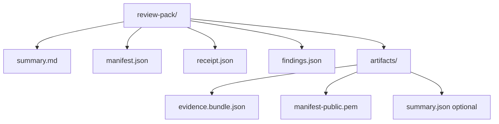
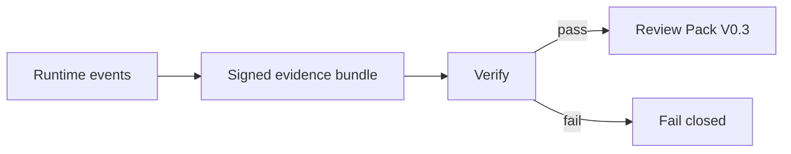
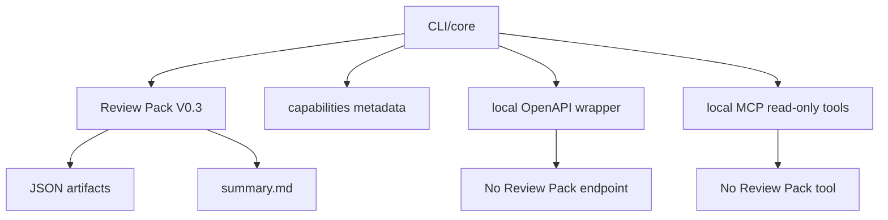
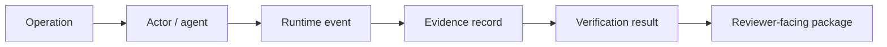

# Agent Evidence Review Packs

Local, Verifiable, Reviewer-Facing Artifacts for AI Agent Runs

## Abstract

AI agent systems commonly produce traces, logs, and tool-call records, but
these artifacts are often bound to platforms or operator workflows rather than
packaged for independent post-execution review. This technical note presents
Review Pack V0.3, implemented in `agent-evidence` v0.6.0, as a local,
offline, verify-first, fail-closed artifact package for AI agent runs. Review
Pack V0.3 transforms a verified signed evidence bundle into a small
reviewer-facing directory containing `summary.md`, `manifest.json`,
`receipt.json`, `findings.json`, and copied public evidence artifacts. It adds
stable `RP-CHECK-*` reviewer checklist IDs, `local_offline` creation metadata,
conservative `secret_scan_status`, and opt-in JSON error output for tool
callers. The contribution is a bounded review layer for humans and agents,
grounded in existing validation tests and smoke paths. It supports portable
inspection without claiming legal non-repudiation, compliance certification,
AI Act approval, official FDO status, full governance automation, hosted
review, or comprehensive DLP.

## Problem Statement

AI agent traces are useful during debugging, but they are often tied to a
runtime, framework, or hosted observability surface. Independent reviewers need
portable post-execution artifacts that preserve verification status, included
evidence, findings, and limitations.

The packaging layer should stay narrow. It should make a run easier to inspect
without becoming a governance platform, compliance product, hosted review
service, or legal proof system.

## Contributions

Review Pack V0.3 contributes exactly four implemented pieces:

1. A local verify-first / fail-closed Review Pack artifact model for signed
   agent evidence bundles.
2. A dual human/agent review surface: `summary.md` plus `manifest.json`,
   `receipt.json`, and `findings.json`.
3. Stable `RP-CHECK-*` reviewer checklist IDs and bounded findings/severity
   model.
4. Conservative safety boundaries: no private key copying, no network
   requirement, limited `secret_scan_status`, and no legal/compliance/DLP
   overclaim.

These are artifact and workflow contributions. They are not legal,
regulatory, governance, adoption, or benchmark claims.

## System Scope and Non-Goals

Review Pack V0.3 is local, offline, verify-first, fail-closed,
markdown/JSON-only, and reviewer-facing.

It is not:

- legal non-repudiation
- compliance certification
- AI Act approval
- an official FDO standard or official FDO profile
- a full AI governance platform
- comprehensive DLP
- a hosted review service
- a remote review service

Review Pack V0.3 also does not add PDF/HTML output, dashboards, OpenAPI Review
Pack endpoints, MCP Review Pack tools, remote services, telemetry, or schema
changes.

## Review Pack V0.3 Artifact Model

Review Pack V0.3 writes a small directory:

```text
review-pack/
  manifest.json
  receipt.json
  findings.json
  summary.md
  artifacts/
    evidence.bundle.json
    manifest-public.pem
    summary.json optional
```

`summary.md` is the human-readable entry point. `manifest.json` records pack
metadata, inventory, checklist, boundaries, and `secret_scan_status`.
`receipt.json` records verification and packaging state. `findings.json`
records bounded findings with allowlisted severities. The `artifacts/`
directory contains the verified evidence bundle, public verification key, and
optional source summary. Private keys are not copied.



## Verification and Packaging Flow

Review Pack creation starts from runtime evidence exported into a signed
bundle. The bundle is verified before packaging. If verification fails, pack
creation fails closed and does not produce a successful review pack.

Tampered bundles and bad public keys are covered failure cases. Source
artifacts are not mutated, existing non-empty output directories are protected,
private keys are not copied, and no network access is required for pack
creation.



## Reviewer Checklist

Review Pack V0.3 includes stable reviewer checklist IDs:

- `RP-CHECK-001`: Confirm verification outcome is pass.
- `RP-CHECK-002`: Review the included evidence bundle.
- `RP-CHECK-003`: Review the public key used for verification.
- `RP-CHECK-004`: Review findings and warnings.
- `RP-CHECK-005`: Review limitations before relying on the pack.
- `RP-CHECK-006`: Escalate fail or unknown findings.

The checklist is a reviewer aid. It is not a compliance checklist, approval
workflow, certification method, or legal attestation.

## Machine-Readable Review Surface

Review Pack V0.3 gives tool-using agents a JSON surface:

- `manifest.json` for package metadata, boundaries, and inventory
- `receipt.json` for verification and packaging state
- `findings.json` for bounded findings and severity values
- `--json-errors` for opt-in machine-readable failure output from
  `agent-evidence review-pack create`

These outputs help tools inspect package state without scraping only prose.
They do not introduce a remote review service or universal agent protocol.



## Safety Boundaries

Review Pack V0.3 keeps safety claims conservative:

- no private key copying
- no network requirement during pack creation
- configured secret sentinel checks are recorded
- `secret_scan_status` is limited and not comprehensive DLP
- the pack does not prove all possible secrets are absent
- no telemetry, hosted review service, or remote review service is added

The secret scan status documents configured sentinel checks in generated pack
content. It does not assess every possible source system, secret class,
repository history, runtime environment, or externally supplied artifact.

## Evaluation Evidence

The evaluation evidence is based on existing tests and smoke checks, not
benchmark numbers or adoption metrics.

| Evidence item | What it supports | Boundary |
| --- | --- | --- |
| LangChain Review Pack smoke | A local LangChain example can produce a Review Pack. | Not a benchmark. |
| OpenAI-compatible mock Review Pack smoke | The mock/offline OpenAI-compatible path can produce a Review Pack. | Not a live provider claim. |
| Tampered bundle fail-closed | Modified bundle content does not produce a successful pack. | Does not prove all tamper modes. |
| Bad public key fail-closed | Invalid verification material fails safely. | Limited to tested failure shape. |
| No private key copied | Review Pack output excludes private key artifacts. | Does not audit external storage. |
| Secret sentinel no hit | Configured sentinel values are not serialized into generated packs. | Not comprehensive DLP. |
| No network behavior | Pack creation can run without opening network sockets. | Does not cover unrelated commands. |
| `--json-errors` smoke | Review Pack creation failures can be machine-readable. | Limited to `review-pack create`. |
| Generated metadata checks | Agent-facing metadata remains generated and consistent. | Not an adoption claim. |

## Relationship to Operation Accountability Profile

Review Pack supports post-execution operation accountability by packaging
runtime evidence for review. It connects an operation, runtime events,
evidence records, a signed bundle, verification result, and reviewer-facing
artifacts.

Operation Accountability Profile remains a research framing. Review Pack does
not define an official standard.



## Relationship to FDO / Data Space Context

Review Pack can be mapped conceptually to FDO and data-space language:

- evidence bundles can be treated as portable digital objects
- manifests and receipts can act as review metadata
- Review Packs can support data-space-style accountability workflows

This is only a research bridge. Review Pack V0.3 is not an official FDO
profile, official FDO standard, data-space connector, policy enforcement
system, remote registry, or compliance guarantee.

## Limitations

Review Pack V0.3 is a beta reviewer-facing package. It makes verified evidence
easier to inspect, but it does not prove that the original runtime record is
complete, that every possible secret is absent, or that legal or regulatory
duties are satisfied.

It is not legal proof, legal non-repudiation, compliance certification, AI Act
approval, an official FDO standard, a full AI governance platform,
comprehensive DLP, hosted governance, a hosted review service, or a remote
review service.

## Future Work

Future work should remain staged:

- Review Pack stabilization after more external review
- controlled redaction and reporting research
- related-work citation selection
- figure refinement for a repository white paper
- Zenodo technical report after one refinement cycle
- AI Act Pack planning as a future interpretation layer

AI Act Pack should interpret evidence in a separate future layer. It should
not be merged into the Review Pack artifact model or claims.

## Conclusion

Review Pack V0.3 turns a verified signed evidence bundle into a local,
markdown/JSON reviewer package. Its value is the narrow boundary: portable
post-execution review for humans and tool-using agents without legal,
compliance, governance, hosted-service, or comprehensive DLP claims.
